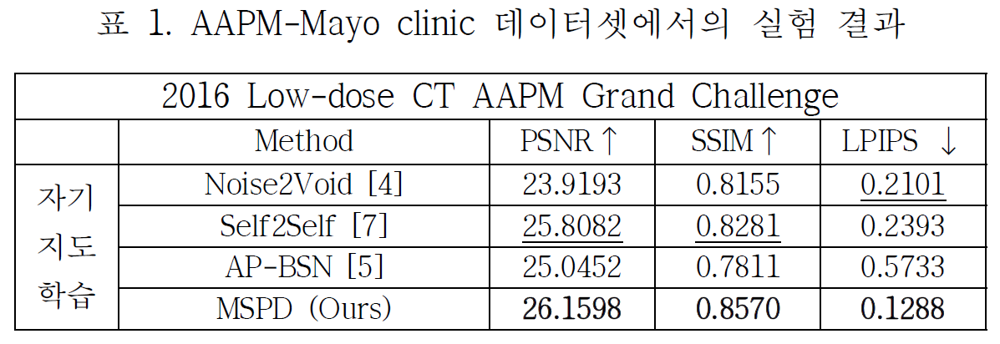

# [KSC 2024] MSPD: A Multi-Scale PD Network for Self-Supervised Low-Dose CT Denoising

<div align=center>

MSPD: 자기 지도 학습 기반 저선량 CT 디노이징을 위한 다해상도 픽셀 무작위 배열 다운샘플링 네트워크

[Eunji Kim](https://scholar.google.com/citations?user=hZXSGOkAAAAJ&hl=ko)<sup>1\*</sup>, Sunghyun Ahn<sup>1</sup>, Hyojeong Lee<sup>2</sup>, Sanghyun Park<sup>1†</sup>

<sup>1</sup>Department of Computer Science, Yonsei University, Republic of Korea

<sup>2</sup>Department of Artificial Intelligence, Yonsei University, Republic of Korea

[paper](https://www.dbpia.co.kr/journal/articleDetail?nodeId=NODE12041810)

</div>


## Abstract
Computed Tomography(CT)는 질병 진단에 있어 필수적인 의료 영상이다. Low-Dose CT(LDCT)는 환자의 방사선 노출을 줄이기 위해 사용되지만 노이즈가 포함되어 정확한 진단을 어렵게 한다. 디노이징은 이러한 노이즈를 제거하면서 구조적인 정보 및 미세한 디테일을 보존하는 방법이다. 하지만 기존의 딥러닝 기반의 디노이징 방법들은 세부 정보나 해부학적 구조가 손실되는 경향이 있어 영상 분석에 부정적인 영향을 미칠 수 있다. 이를 위해 본 연구에서는 Pixel-Shuffle Downsampling(PD) 기반의 다해상도 디노이징 방법을 제안한다. 제안하는 모델은 노이즈를 제거하면서 구조적인 정보와 미세한 정보를 보존한다. 실험 결과, 제안된 모델은 기존 모델들에 비해 높은 디노이징 성능을 보였다.


## Proposed method


## Experiment



## Requirements
```
pip install -r requirements.txt
```


## Train
```
python train.py
```

## Test
```
python test.py
```
